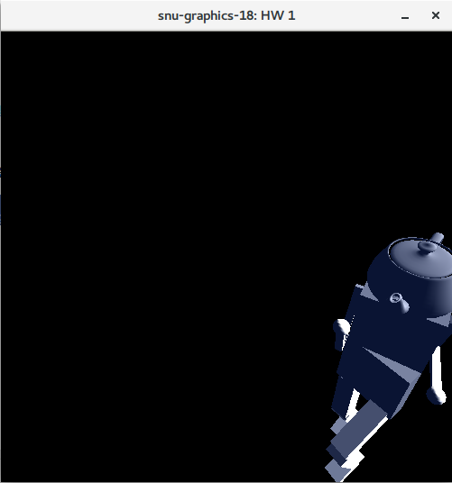
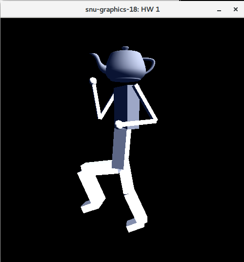
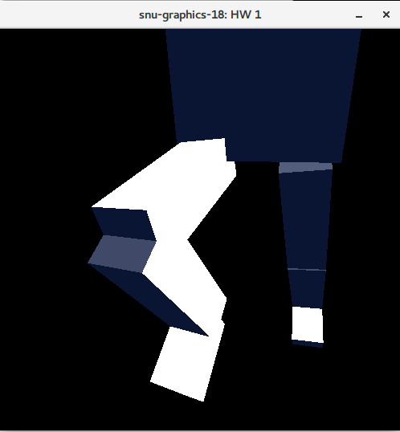
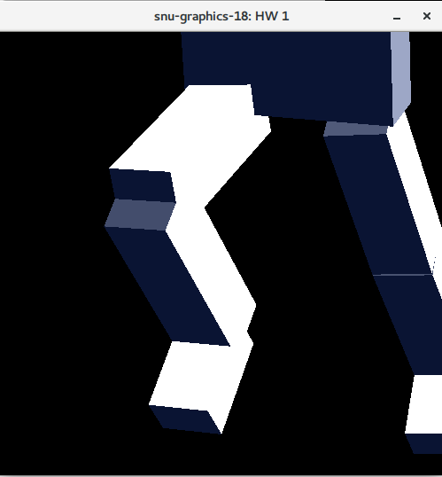

# 2018-1 그래픽스 HW 2 보고서

### Requirement

```
- GCC/Clang (c++ 11의 충분한 지원이 필요)
- OpenGL
- FreeGLUT
- CMake >= 3.8
- git (Github 에서 eigen 의존성을 다운로드 받으며 사용한다)
- 인터넷 연결 (Github 에서 eigen 의존성을 다운로드 받기 위해 필요하다)
```

## How to build and run

```sh
bash ./run.sh
```

## 기능 설명

### 평행이동



왼쪽 마우스를 클릭한 채로 화면의 상하좌우로 드래그하면 카메라를 평행이동할 수 있다. 시점 원점을 지나는, 카메라 방향에 수직한 평면이 마우스의 위치를 따라 평행이동하게끔 구현했다.

```cpp
//  main.cpp::motion(int x, int y);
const auto diff = curr - mousePos;
viewCenter = initialCenter + (u_right * diff[0] + u_up * diff[1]) * distance/projDist;
```

### 회전



오른쪽 마우스를 클릭한 채로 화면의 상하좌우로 드래그하면, 시점 원점을 중심으로 카메라를 회전시킬 수 있다. 스크린 평면을 가득 채우는 반구형의 트랙볼을 상정하고 회전각을 계산하기 때문에 모델의 줌인/아웃과 관계 없이 일관된 회전비율을 갖는다. Quaternion을 이용하여 구현했기 때문에 gimbal lock 현상이 없다.

```cpp
//  main.cpp::motion(int x, int y);
const auto from = getVirtualTrackballXYZ(mousePos * 2, u_right, u_up, u_front);
const auto to = getVirtualTrackballXYZ(curr * 2, u_right, u_up, u_front);

const auto rot = Eigen::Quaternionf::FromTwoVectors(from, to);

camDir = (rot * toQuaternion(initialDir) * rot.inverse()).vec().normalized();
camUp = (rot * toQuaternion(initialUp) * rot.inverse()).vec().normalized();
```
### 확대축소
#### 거리 조절



마우스 휠을 스크롤하면 카메라가 시점 원점에서부터 멀어지고 가까워진다. 시점 원점이 움직이지 않으며, 시점 원점과 카메라 사이의 거리가 멀어지게끔 구현하였다.

#### FOV 조절



SHIFT키를 누른 채 마우스 휠을 스크롤하면 카메라의 FOV가 조정된다. 거리 조절을 통한 확대에 비해 원근감이 약한 것을 확인할 수 있다.

```cpp
case 3:
if ( state == GLUT_DOWN ) {
  if (glutGetModifiers() & GLUT_ACTIVE_SHIFT) {
    fov = std::max(fov/1.1f, 10.0f);
  } else {
    distance /= 1.1;
  }
}
break;
case 4:
if ( state == GLUT_DOWN ) {
  if (glutGetModifiers() & GLUT_ACTIVE_SHIFT) {
    fov = std::min(fov * 1.1f, 179.0f);
  } else {
    distance *= 1.1;
  }
}
break;
```
### Show All 과 Seek

구현하지 않았다.