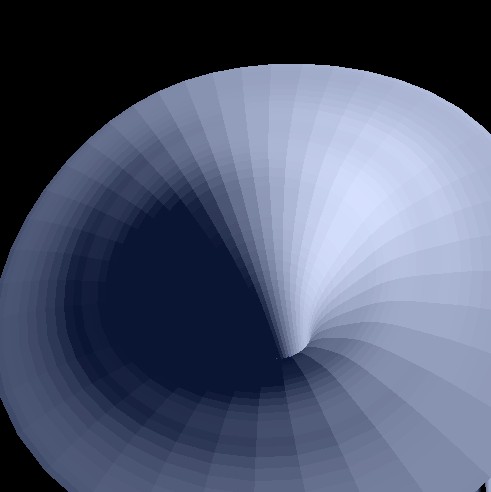
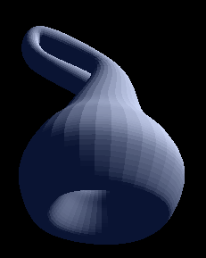

# 2018-1 그래픽스 HW 3 보고서

### Requirement

```
- GCC/Clang (c++ 11의 충분한 지원이 필요)
- OpenGL
- FreeGLUT
- CMake >= 3.8
```

## How to build and run

```sh
bash ./run.sh
```
## 기능 설명

### 파일 포맷의 읽기

```SweptSurfaceData::load``` 함수는 파일이름 혹은 인풋 스트림으로부터 과제에서 제시된 표준 파일 포맷을 읽을 수 있다 (비정상적인 포맷은 고려하지 않았다). 그 결과로 ```SweptSurfaceData``` 객체를 내놓는다. rotation 이 Quaternion w, x, y, z 형식이 아니라, 읽는 과정에서 exp(w, x, y, z) 를 해 불러들여온다.

표준 포맷에 #으로 시작하는 line comment가 있기 때문에, 이를 위해 주석을 제거한 스트림을 읽는 ```comment_filter_istream``` 을 만들어 효과적으로 주석을 제거하고 읽을 수 있다.

###  Spline and Catmull Rom

Catmull Rom 은 curve interpolate에서 경계 조건으로 
$p'(0) = (p(1)-p(0))/2 $
$p'(n-1) = (p(n-1)-p(n-2))/2 $
$p'(k) = (p(k+1) - p(k-1))/2 $ 
를 사용하였으며, closed loop interpolate에서 경계조건으로는
$p'(0) = (p(1)-p(n-1))/2 $
$p'(n-1) = (p(n-1)-p(n-2))/2 $
$p'(k) = (p(k+1) - p(0))/2 $ 
를 사용하였다.

```Interpolate.cpp``` 의 ```Bezier::interpolate<Eigen::Vector3f>```를 보면 알 수 있듯, 행렬 곱셈법을 사용했다.

```cpp
const Eigen::RowVector4f T { powf(t, 3), powf(t, 2), t, 1 };
Eigen::Matrix4f M;
M <<-1, 3, -3, 1,
	3, -6, 3, 0,
	-3, 3, 0, 0,
	1, 0, 0, 0;
Eigen::Matrix<float, 4, 3> G;
G.row(0) = b0.transpose();
G.row(1) = b1.transpose();
G.row(2) = b2.transpose();
G.row(3) = b3.transpose();
return T * M * G;
```

BSpline 역시 평이하게 ```Interpolate.cpp``` 의 ```BSpline::approx<Eigen::Vector3f>```를 보면 알 수 있듯, 행렬 곱셈법을 사용했다.

```cpp
const Eigen::RowVector4f T { powf(t, 3), powf(t, 2), t, 1 };
Eigen::Matrix4f M;
M <<-1, 3, -3, 1,
      3, -6, 3, 0,
      -3, 0, 3, 0,
      1, 4, 1, 0
      ;
Eigen::Matrix<float, 4, 3> G;
G.row(0) = b0.transpose();
G.row(1) = b1.transpose();
G.row(2) = b2.transpose();
G.row(3) = b3.transpose();
return T * (1/6.0f) * M * G;
```

Quaternion Interpolation 은 Quaternion Catmull Rom 와 De Casteljau 메소드를 사용했다.
```Interpolate.cpp``` 의 ```DeCasteljau::interpolate<Eigen::Quaternionf>```를 사용했는데, 이름과 구현에서 보다시피 De Casteljau 에 기반한 multi linear 보간법을 사용하였다.
Quaternion Catmull Rom:
$$
p_0 = b_1 \\\\
p_1 = b_1*exp(log(b_0^{-1} * b2)/6)) \\\\
p_2 = b_2*exp(log(b_1^{-1} * b3)/6)) \\\\
p_3 = b_3
$$
De casteljau:
```cpp
Eigen::Quaternionf a00 = b0.slerp(t, b1);
Eigen::Quaternionf a01 = b1.slerp(t, b2);
Eigen::Quaternionf a02 = b2.slerp(t, b3);

Eigen::Quaternionf a10 = a00.slerp(t, a01);
Eigen::Quaternionf a11 = a01.slerp(t, a02);

Eigen::Quaternionf a20 = a10.slerp(t, a11);
return a20;
```


### Cross Section의 보간

B Spline과 Catmull Rom의 선택은 파일 헤더에 ```BSPLINE``` 혹은 ```CATMULL_ROM```을 작성함으로써 선택할 수 있다.

위에서 읽어온 데이터의 의 렌더링은 ```SweptSurface```클래스가 담당하게 되는데, ```Drawables::create``` 함수 시작부분에서 이에 따라 적절한 함수를 호출한다.

보간 subdivision 개수는 10개로 고정되어있다.

```cpp
switch(data.curve_type) {
case CurveType::CATMULL_ROM:
    cross_sections = interpolate_cross_sections(
        catmull_rom<Bezier, Eigen::Vector3f>, data.cross_sections); break;
case CurveType ::BSPLINE:
    cross_sections = interpolate_cross_sections(
        bspline<Eigen::Vector3f>, data.cross_sections); break;
  default: assert(false);
}
```

### Geometric transformation의 보간
* scale은 Bezier Catmull Rom 보간을 한다.
* position은 Bezier Catmull Rom 보간을 한다.
* rotation은 Quaternion Catmull Rom 보간을 한다.
* p 는 보간된 cross section의 같은 인덱스를 갖는 vertex를 따라서 Bezier Catmull Rom 보간을 한다.
* 이 p를 ```position + rotataion * scale * p``` 한 것이 최종적으로 cross section 평면과 cross section에 수직한 평면을 따라 모두 보간된 점이다.
* 보간 subdivision 개수는 10개로 고정되어있다.

### Visualize the swept surface as a polygonal mesh
보간된 평면의 subdivision을 잘 드러내기 위해 일부러 부드럽게 렌더링하지 않았다. 다음 그림은 cross section당 4개의 control point를 사용하고, 10단계로 subdivide한 모습이다. 삼각형의 normal vector를 지정하였기 때문에 광원에 따라 적당한 밝기를 가진다.



### interaction

이전 과제 코드에 기반해 작업해서 화면을 평행이동, 줌인/줌아웃, 돌리 인/돌리 아웃, 회전이 가능하다.

###  Create your own swept surfaces that are aesthetically pleasing.


클라인 병을 만들었다. 

### 하지 않은 사항

클라인병은 실존하지 않는 물체이므로 3D 프린팅 하지 않았다.